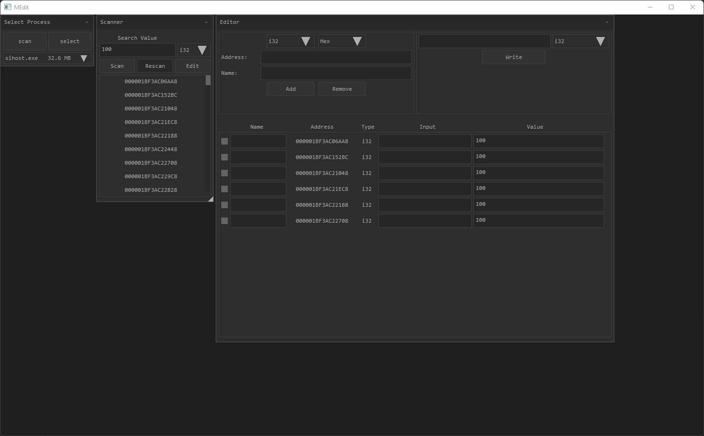

# **Medit**

## **A simple memory editor.**

## **Description**

Medit is a simple to use scanner and memory editor made for educational purposes.
It is by no means as good as something like cheat engine. It is meant as an excercise for me to learn how to write more complex programs. I intentd to expand on it in the future and add more functionality, but there no exact time for when that will be.

## **Build instructions**

### requirements:
- clang
- visual studio with the c++ package

To build simply call the build_release.cmd script. The executable will be outputed in the build directory.